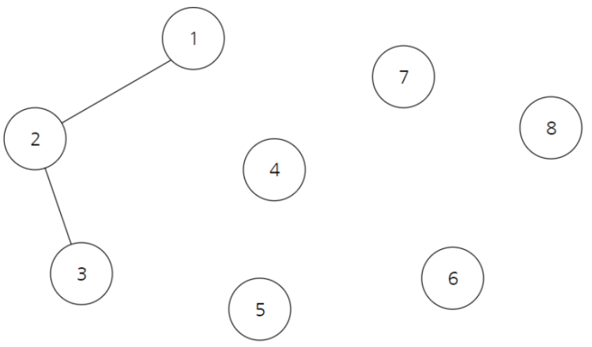

# **유니온 파인드 (Union-Find)**

합집합 찾기 알고리즘  
여러개의 노드가 존재할 때, 두 개의 노드를 선택해서 이 노드들이 같은 그래프에 속하는지 판별  

  
아래처럼 그래프를 표현할 수 있다  
부모를 합칠 때, 더 작은 노드 쪽으로 합친다  
(1, 2) -> 1  
(2, 3) -> 2  

|1|2|3|4|5|6|7|8|
|--|--|--|--|--|--|--|--|
|1|1|2|4|5|6|7|8|

1. 재귀 함수를 사용하여 각 노드의 부모 노드 탐색
2. 부모 노드가 같은지 판별   

## **Kruskal Algorithm 구현**

**Kruskal 동작과정**  

1. 모든 간선을 가중치 값에 따라 오름차순으로 정렬 
2. 모든 정점이 연결될 때까지 간선 선택  
    - _단, 사이클을 형성하는 간선은 버린다_    

간선 (V1, V2)가 사이클을 형성하려면, 
V1과 V2가 같은 그래프에 속해야 한다  

즉, V1과 V2의 부모 노드가 같은지 확인할 때, Union-Find 알고리즘을 활용한다  
